## MD Flowchart: Wireless Connection Steps

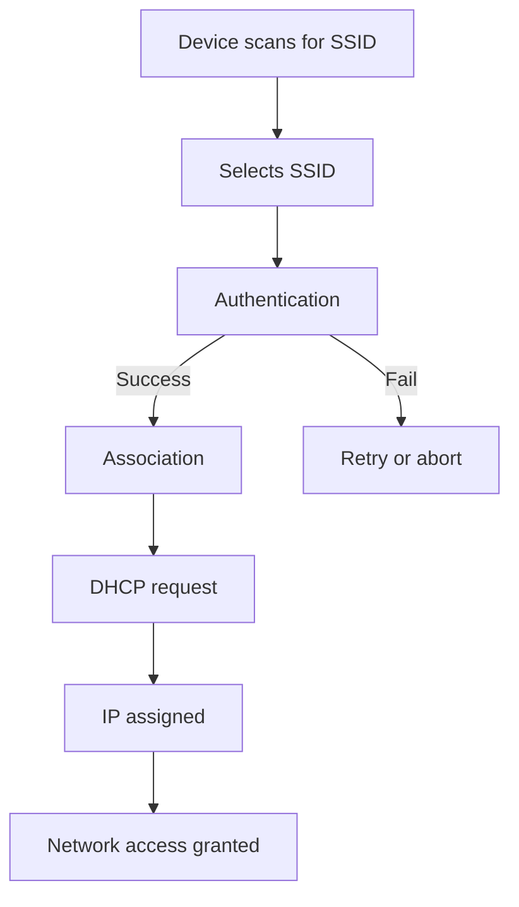

### Visual Explanation (Wireless Connection)
- **Scan:** Device scans for available wireless networks (SSIDs).
- **Select:** User/device selects desired SSID.
- **Authenticate:** Device authenticates with access point (password, certificate).
- **Associate:** Successful authentication leads to association with AP.
- **DHCP:** Device requests IP address via DHCP.
- **IP Assigned:** DHCP server assigns IP.
- **Access:** Device gains access to network resources.


## MD Flowchart: Firewall Packet Flow

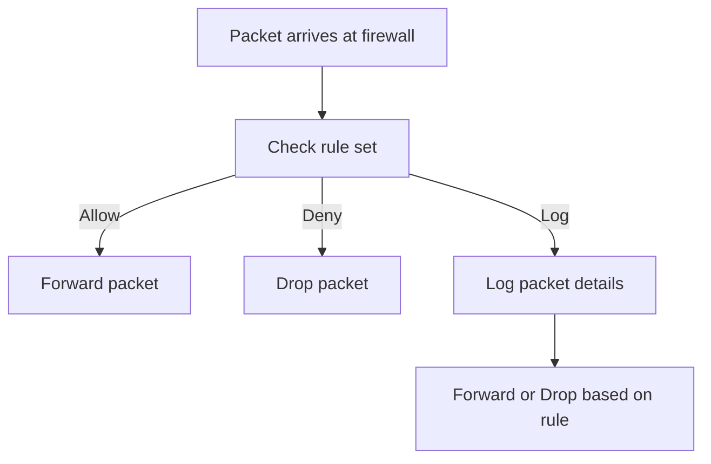

### Visual Explanation (Firewall)
- **Packet Arrival:** Packet reaches firewall for inspection.
- **Rule Set Check:** Firewall checks packet against its rule set.
- **Allow/Deny/Log:** Packet is allowed, denied, or logged based on rules.
- **Action:** Allowed packets are forwarded; denied packets are dropped; logged packets are recorded for auditing.


## MD Flowchart: VLAN Tagging Process

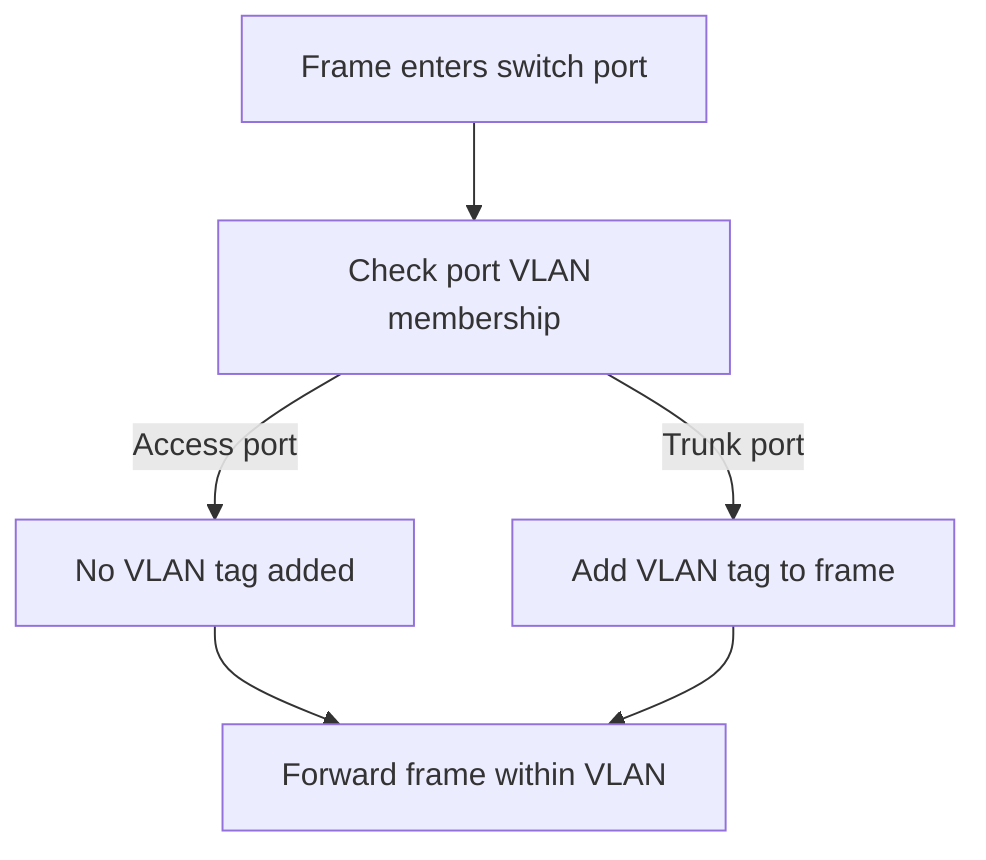

### Visual Explanation (VLAN Tagging)
- **Frame Entry:** Data frame enters a switch port.
- **VLAN Membership:** Switch checks if port is access or trunk.
- **Access Port:** No VLAN tag is added; frame is forwarded within VLAN.
- **Trunk Port:** VLAN tag is added to frame for inter-switch transport.


## MD Flowchart: NAT (Network Address Translation) Process

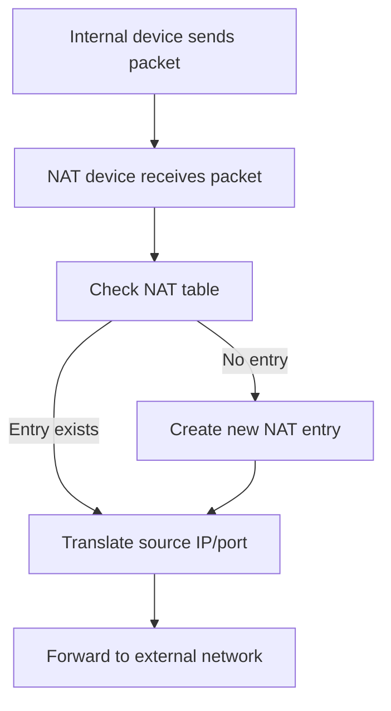

### Visual Explanation (NAT)
- **Internal Device:** Device on private network sends packet to external network.
- **NAT Device:** Router/firewall receives packet and checks NAT table.
- **NAT Table Lookup:** If entry exists, translates source IP/port; if not, creates new entry.
- **Forward:** Packet is forwarded to external network with translated address.


## MD Flowchart: Basic Switching Process

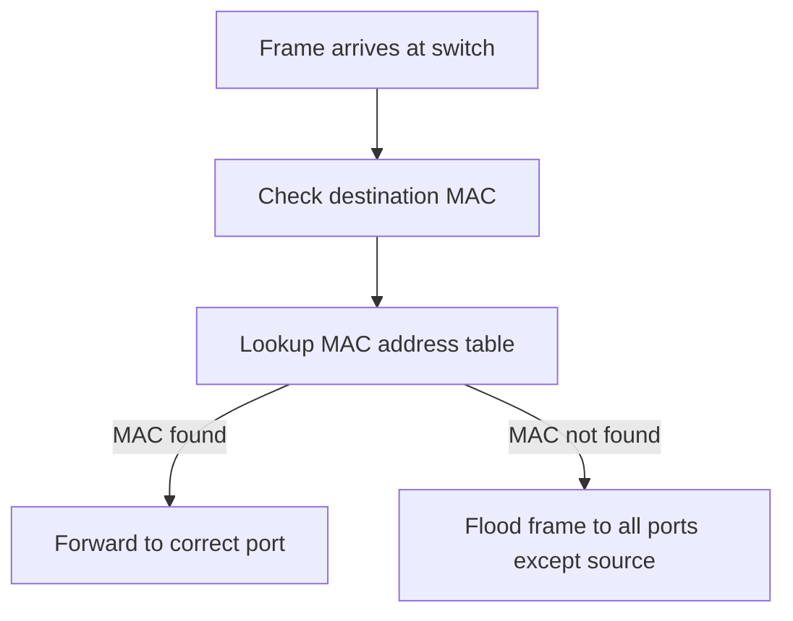

### Visual Explanation (Switching)
- **Frame Arrives:** Switch receives a data frame from a device.
- **Destination MAC:** Switch checks the destination MAC address in the frame.
- **MAC Table Lookup:** Switch searches its MAC address table for the destination.
- **Forward/Flood:** If found, frame is sent to the correct port; if not, frame is flooded to all ports except the source.


## MD Flowchart: Basic Routing Process

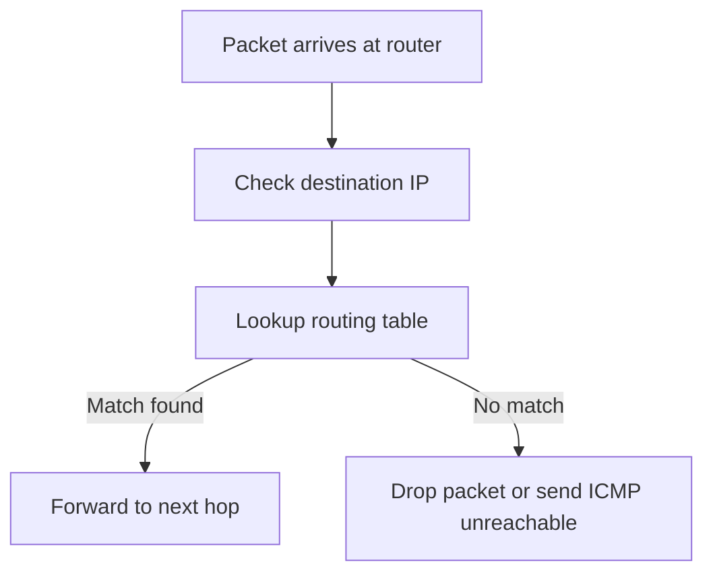

### Visual Explanation (Routing)
- **Packet Arrives:** Router receives a packet from a device or another router.
- **Destination IP:** Router checks the destination IP address in the packet.
- **Routing Table Lookup:** Router searches its routing table for a matching network.
- **Forward/Drop:** If a match is found, packet is forwarded to the next hop; if not, packet is dropped or an ICMP unreachable message is sent.


## MD Flowchart: Network Packet Journey

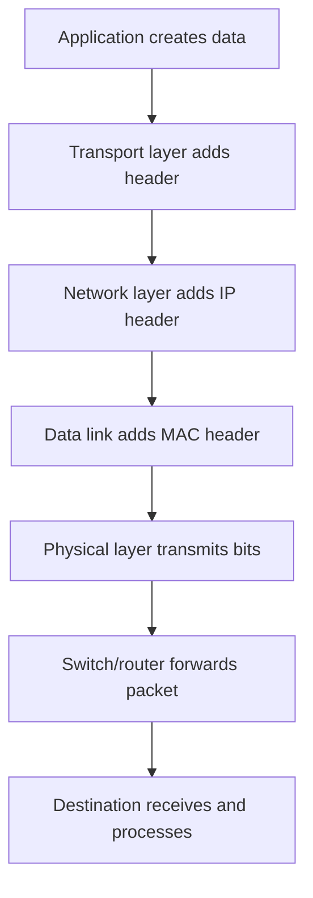

### Visual Explanation (Packet Journey)
- **Application:** Data originates from user/application.
- **Transport:** TCP/UDP header added for reliability or speed.
- **Network:** IP header added for addressing/routing.
- **Data Link:** MAC header added for local delivery.
- **Physical:** Bits transmitted over medium (cable, wireless).
- **Switch/Router:** Device forwards packet based on MAC/IP.
- **Destination:** Target device receives and processes data.


## MD Flowchart: DNS Resolution

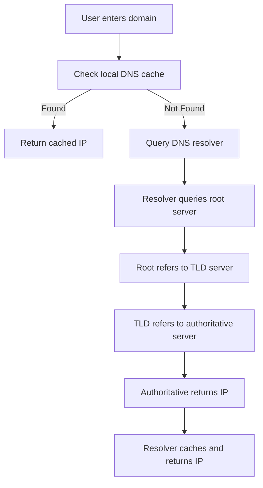

### Visual Explanation (DNS Resolution)
- **Local Cache:** System checks if IP for domain is cached locally.
- **DNS Resolver:** If not, queries DNS resolver (ISP or configured server).
- **Root/TLD/Authoritative:** Resolver may query root, TLD, and authoritative servers in sequence.
- **IP Returned:** Once found, IP is cached and returned to user/application.


## MD Flowchart: DHCP Process

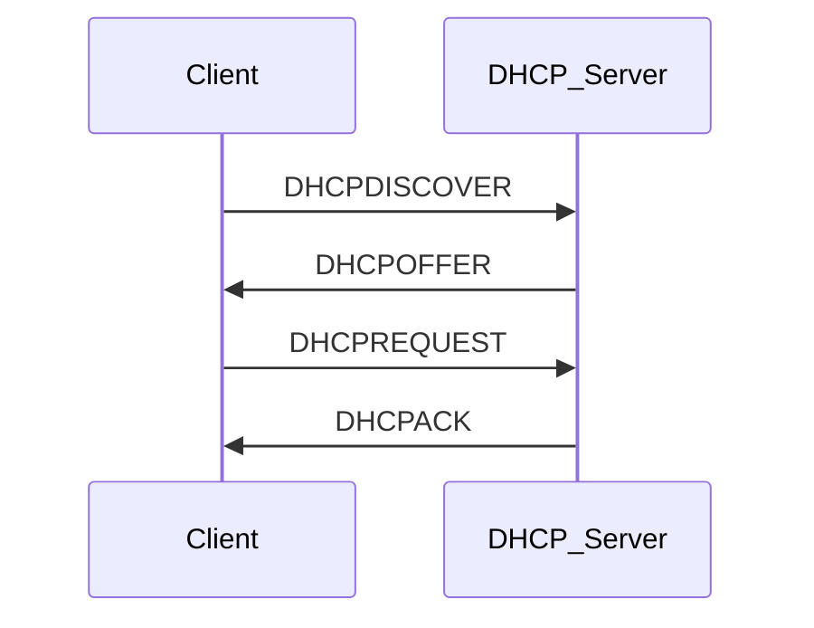

### Visual Explanation (DHCP Process)
- **DHCPDISCOVER:** Client broadcasts to find DHCP servers.
- **DHCPOFFER:** Server replies with available IP configuration.
- **DHCPREQUEST:** Client requests offered IP.
- **DHCPACK:** Server acknowledges and assigns IP to client.


## MD Flowchart: ARP Resolution

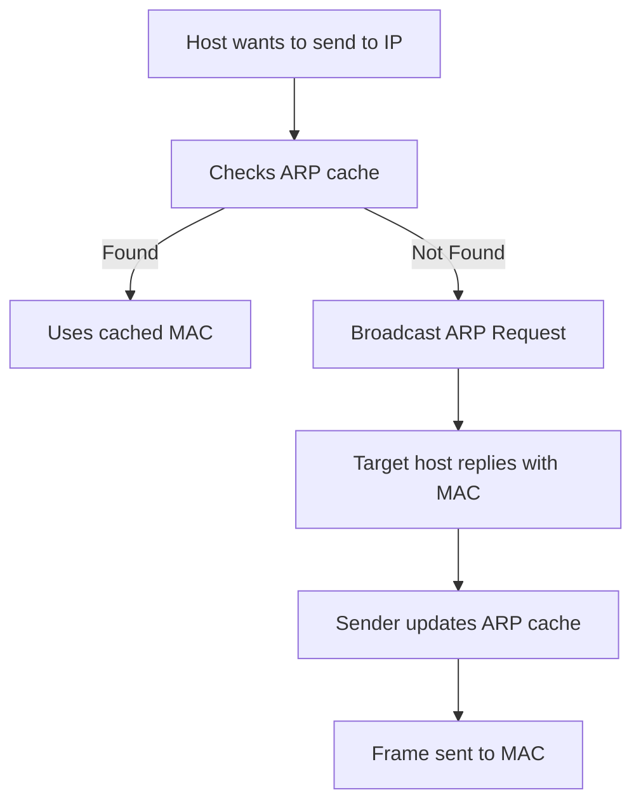

### Visual Explanation (ARP Resolution)
- **ARP Cache Check:** Host checks if MAC for IP is already known.
- **ARP Request:** If not, broadcasts ARP request to network.
- **ARP Reply:** Target host responds with its MAC address.
- **Cache Update:** Sender stores MAC in ARP cache for future use.
- **Frame Sent:** Data frame is sent to resolved MAC address.


## MD Flowchart: TCP Three-Way Handshake

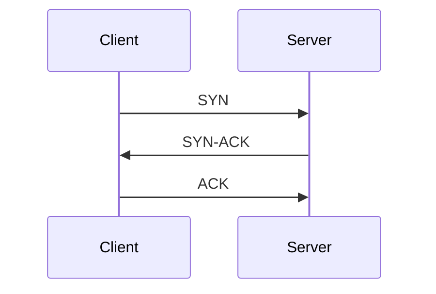

### Visual Explanation (TCP Handshake)
- **SYN:** Client initiates connection by sending SYN packet.
- **SYN-ACK:** Server responds with SYN-ACK to acknowledge and synchronize.
- **ACK:** Client sends ACK to finalize connection setup.


## MD Flowchart: Subnetting Steps

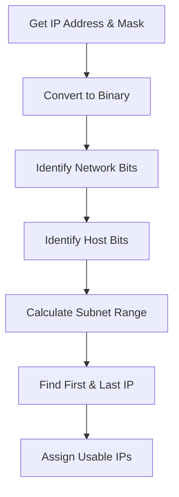

### Visual Explanation (Subnetting Steps)
- **Get IP Address & Mask:** Start with the given IP and subnet mask.
- **Convert to Binary:** Write both in binary to visualize network/host division.
- **Identify Network Bits:** Count bits set by the mask (network portion).
- **Identify Host Bits:** Remaining bits are for hosts.
- **Calculate Subnet Range:** Determine total subnets and hosts per subnet.
- **Find First & Last IP:** Identify network address, broadcast address, and usable range.
- **Assign Usable IPs:** Allocate IPs to devices within the subnet.


## MD Flowchart: OSI Model Layers

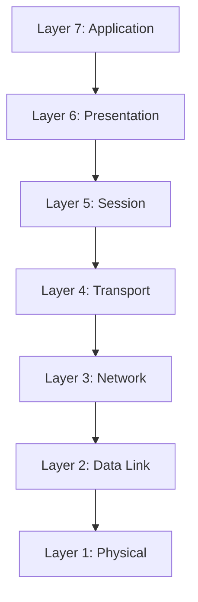

### Visual Explanation (OSI Layers)
- **Application:** User interfaces, network services (HTTP, FTP, SMTP).
- **Presentation:** Data translation, encryption, compression.
- **Session:** Establishes, manages, and terminates sessions.
- **Transport:** Reliable data transfer, error recovery (TCP/UDP).
- **Network:** Routing, addressing (IP).
- **Data Link:** MAC addressing, error detection (Ethernet, switches).
- **Physical:** Transmission media, signals, hardware (cables, NIC).


## MD Flowchart: Network Troubleshooting Overview

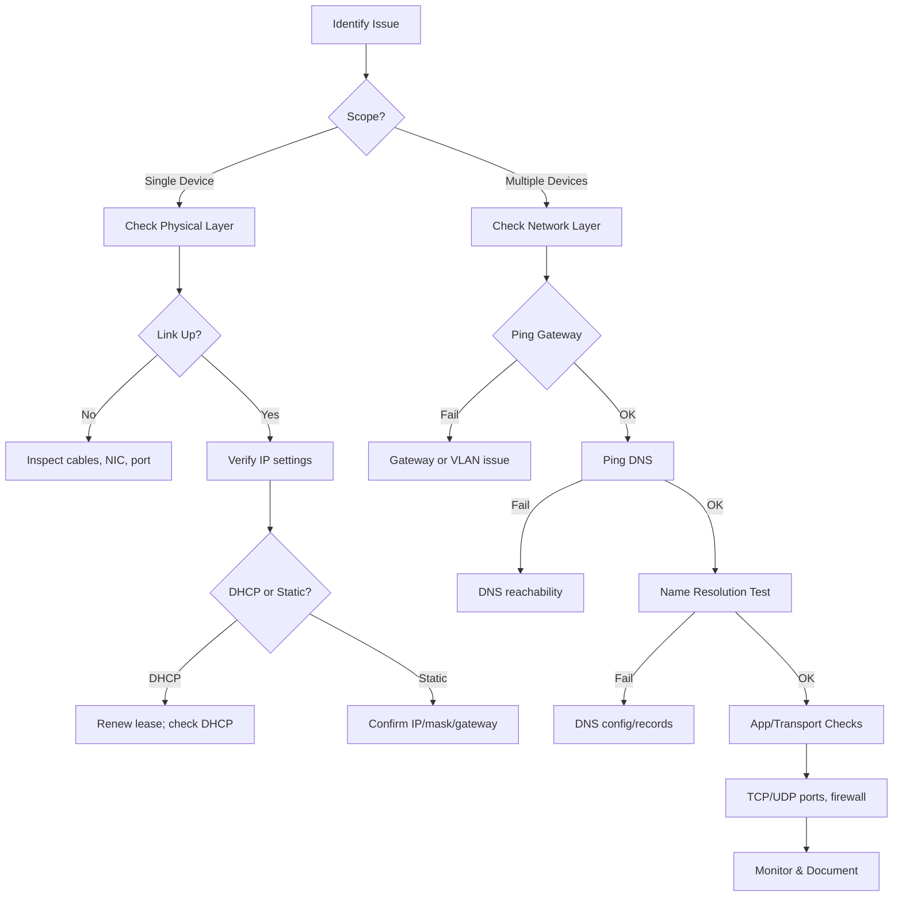

### Visual Explanation (Using MD Flow)
- **Identify Issue:** Start by clearly defining symptoms (e.g., no internet, slow throughput, service unreachable).
- **Scope:** Determine if the problem affects a single host or multiple hosts; this guides whether to focus on local or network-wide causes.
- **Physical Layer:** For single-host issues, confirm link status; inspect cables, switch port, and NIC if the link is down.
- **IP Settings:** Verify whether the device uses DHCP or static addressing; renew DHCP lease or validate static IP, subnet mask, and default gateway.
- **Gateway Reachability:** For multi-host or network-layer checks, ensure hosts can ping the default gateway; failures often indicate VLAN, routing, or gateway faults.
- **DNS Reachability and Resolution:** Test connectivity to DNS servers and attempt hostname lookups; fix reachability or configuration/records as needed.
- **Transport/Application Checks:** Validate required ports and firewall rules; test specific application protocols.
- **Monitor & Document:** After remediation, monitor to confirm stability and document actions taken for future reference.

# COMPUTER NETWORKS FINAL EXAM STUDY GUIDE
## Complete Slide-Aligned Notes with Deep Focus on Slides 9-17

---

# TABLE OF CONTENTS
1. Executive Summary
2. Complete Lecture Notes (Lec 5-6 through Lec 17-19)
3. Deep Dive: Slides 9-17 (Exam Core - 60%)
4. Complete Exam Question Bank
5. Final One-Page Cheat Sheet
6. Quick-Reference Formulas & Tables

---

# EXECUTIVE SUMMARY

**Your Exam Strategy:**
- **Slides 9-17 = 60% of exam** (DNS, RDT, TCP Fundamentals, Flow Control, Congestion Control)
- **Slides 1-8 + 18+ = 40%** (Supporting material: HTTP, Email, Sockets, QUIC)
- **What teacher tests:** Exact slide definitions, formulas, diagrams, examples
- **How to score:** Memorize structures, trace protocols step-by-step, calculate formulas

**Critical Facts to Lock In:**
- DNS is hierarchical (Root → TLD → Auth → Local)
- TCP sequence numbers count BYTES, not segments
- Three RTT formulas MUST be memorized perfectly
- Flow control prevents receiver overflow; congestion control prevents network collapse
- AIMD = Additive Increase + Multiplicative Decrease

---

# PART 1: COMPLETE LECTURE NOTES

## LECTURE 5-6: PRINCIPLES OF NETWORK APPLICATIONS

### 1.1 Application Layer Overview

**Definition:** Layer where users and applications interact with network

**Key Principle:**
- Application developers write programs for END SYSTEMS
- NO code needed for network-core devices
- Application developers control: Application + Transport layers
- OS controls: Network + Link layers

**Common Network Applications:**
- Social media, Web, Text messaging, Email
- Multi-user network games
- Streaming stored video (YouTube, Hulu, Netflix)
- P2P file sharing
- Voice over IP, Video conferencing, Internet search
- Remote login

### 1.2 Architecture Paradigms

**CLIENT-SERVER ARCHITECTURE:**
| Characteristic | Server | Client |
|---|---|---|
| Availability | Always-on | Intermittently connected |
| IP Address | Permanent | Dynamic |
| Location | Data centers | Home/mobile/enterprise |
| Initiates Communication | No | Yes |
| Examples | HTTP, IMAP, FTP | Browser, Mail app |

**PEER-TO-PEER (P2P) ARCHITECTURE:**
- NO always-on server
- Peers = both clients AND servers
- Direct end-to-end communication
- SELF-SCALABILITY: New peers = new capacity + new demands
- Complex management: Peers intermittently connected, changing IPs
- Examples: BitTorrent, P2P file sharing

### 1.3 Processes & Sockets

**Concepts:**
- **Process:** Program running within a host
- **Socket:** "Door" between application process and transport layer
- **Port number:** Identifies process on host (HTTP=80, SMTP=25)
- **Full address:** (IP address + port number) uniquely identifies process
- **Analogy:** IP = apartment building address; Port = apartment number

### 1.4 Application Layer Protocols

**What They Define:**
- Types of messages exchanged (request, response)
- Message syntax (fields, separators)
- Message semantics (meaning of information)
- Rules (when/how processes send and respond)

**Protocol Types:**
- **Open protocols:** Defined in RFCs (HTTP, SMTP) → everyone has access
- **Proprietary protocols:** Not publicly defined (Zoom, Skype internals)

### 1.5 Transport Service Requirements

**Table: Application Requirements vs Transport Services**

| Application | Data Loss | Throughput | Timing Sensitive? |
|---|---|---|---|
| File transfer | NO loss | Elastic | No |
| Email | NO loss | Elastic | No |
| Web documents | NO loss | Elastic | No |
| Real-time audio/video | Loss-tolerant | 5K-1M bps | YES - 10s ms |
| Streaming audio/video | Loss-tolerant | Same | YES - few seconds |
| Interactive games | Loss-tolerant | Kbps+ | YES - 10s ms |
| Text messaging | NO loss | Elastic | Yes & No |

### 1.6 TCP vs UDP

**TCP (Transmission Control Protocol):**
- ✓ Reliable transport (in-order delivery)
- ✓ Flow control (sender won't overwhelm receiver)
- ✓ Congestion control (network-aware throttling)
- ✓ Connection-oriented (setup required)
- ✗ NO timing, minimum throughput, security

**UDP (User Datagram Protocol):**
- ✓ Unreliable (segments may be lost or reordered)
- ✓ Connectionless (no setup)
- ✓ Minimal overhead
- ✓ Can function during network congestion
- ✗ NO reliability, flow control, congestion control, security

**Why UDP Exists?**
- **Philosophy:** FAST & CURRENT > SLOW & PERFECT
- **Advantages:** No setup delay, simple, lower latency
- **Use:** Real-time apps (VoIP, video, gaming), DNS

---

## LECTURE 7-8: HTTP, COOKIES, WEB CACHING, EMAIL

### 2.1 HTTP: HyperText Transfer Protocol

**Definition:** Web's application-layer protocol for client-server communication

**Basic Model:**
- Client: Browser (Firefox, Safari, Chrome)
- Server: Web server (Apache, Nginx)
- Protocol: HTTP
- Transport: TCP (port 80 for HTTP, 443 for HTTPS)
- Stateless: Server maintains NO memory of past requests

### 2.2 HTTP Connection Types

**NON-PERSISTENT HTTP (HTTP/1.0):**
- TCP connection opened
- AT MOST 1 object sent over connection
- TCP connection closed
- Multiple objects = multiple connections needed
- Response time = 2RTT + file transmission time
- Issue: Slow, multiple TCP setups

**PERSISTENT HTTP (HTTP/1.1):**
- TCP connection opened to server
- MULTIPLE objects sent over SINGLE connection
- TCP connection can remain open for multiple requests
- Much faster: As little as 1 RTT for all referenced objects
- Benefit: Cuts response time in half
- Pipelining: Client sends multiple requests without waiting for responses

### 2.3 HTTP Request Message Format

**Structure (ASCII format):**

```
GET /index.html HTTP/1.1
Host: www-net.cs.umass.edu
User-Agent: Mozilla/5.0...
Accept: text/html,...
Accept-Language: en-us,en;q=0.5
Accept-Encoding: gzip,deflate
Connection: keep-alive

[optional message body for POST]
```

**Key Elements:**
- **Request line:** METHOD URL HTTP-VERSION
  - GET: Retrieve resource (parameters in URL)
  - POST: Submit data (parameters in body)
  - HEAD: Get metadata only, no object
  - PUT: Upload/replace file
- **Header lines:** Additional information
- **\\r\\n:** Carriage return + line feed (marks line ends)

### 2.4 HTTP Response Message Format

**Structure:**

```
HTTP/1.1 200 OK
Date: Tue, 08 Sep 2020 00:53:20 GMT
Server: Apache/2.4.6
Last-Modified: Tue, 01 Mar 2016 18:57:50 GMT
Content-Length: 2651
Content-Type: text/html; charset=UTF-8

[HTML content/object data]
```

**Status Codes (Memory Trick):**
- **2xx = Success! 🎉** (200 OK, 201 Created, 204 No Content)
- **3xx = Moved/Redirect 🔄** (301 Moved Permanently, 304 Not Modified)
- **4xx = Your mistake 🤦** (400 Bad Request, 404 Not Found)
- **5xx = Server's mistake 🔧** (500 Internal Server Error, 505 HTTP Version Not Supported)

**Common Codes:**
- 200 OK: Request succeeded, object follows
- 301 Moved Permanently: New location in Location field
- 304 Not Modified: Cached copy is up-to-date
- 400 Bad Request: Request misunderstood
- 404 Not Found: Object doesn't exist
- 505 HTTP Version Not Supported

### 2.5 Cookies: Maintaining State

**Purpose:**
- Authorization (login/session)
- Shopping carts (e-commerce)
- Recommendations (personalization)
- User session state (Web email)

**Four-Component System:**
1. **Set-Cookie header** in server response
2. **Cookie header** in client requests (subsequent)
3. **Cookie file** on user's computer (browser storage)
4. **Database record** on server (links cookie ID to session)

**How It Works:**
```
First visit:
  Browser → Server
  Server creates unique ID + database entry
  Sends Set-Cookie header with ID
  Browser stores cookie locally

Subsequent visits:
  Browser sends cookie ID in HTTP requests
  Server recognizes user from cookie
  Server retrieves session from database
```

**Cookie Types & Privacy:**
- **First-party cookies:** From site you chose to visit (acceptable)
- **Third-party cookies:** From sites you didn't visit (tracking!)
  - AdX tracks browsing across multiple sites
  - Blocked by default: Safari (2019), Firefox (2020)
  - Chrome decided to keep them (2025)
- **GDPR Impact:** Cookies identifying individuals = personal data (regulated)

### 2.6 Web Caching (Proxy Servers)

**Goal:** Satisfy client requests WITHOUT involving origin server every time

**Mechanism:**
1. Browser configured to point to local web cache
2. Client sends HTTP requests to cache
3. IF object in cache → cache returns object immediately
4. ELSE → cache requests from origin server, caches it, returns to client

**Benefits:**
- Reduce response time for client (cache closer to client)
- Reduce traffic on institution's access link
- Internet-wide caching enables poor providers to deliver content effectively

**Performance Example:**
| Metric | Without Cache | With Cache (0.4 hit rate) |
|---|---|---|
| Access link utilization | 0.97 (HIGH) | 0.58 (LOW) |
| End-end delay | 2+ seconds | 1.2 seconds |
| User experience | Slow, queuing | Fast |

**Conditional GET (Cache Freshness):**
- Goal: Don't send object if browser has up-to-date cached version
- Client: "If-modified-since: <date>"
- Server: If not modified → "304 Not Modified" (no data transfer!)
- Benefit: Saves bandwidth

### 2.7 HTTP/2 & HTTP/3

**HTTP/1.1 Problem: Head-of-Line (HOL) Blocking**
- Server responds in FCFS order (first-come-first-served)
- Small object waits behind large object
- Loss recovery stalls ALL transmissions
- Result: Slower small-object delivery

**HTTP/2 Solution (RFC 7540, 2015):**
- ✓ Divide objects into frames
- ✓ Schedule frames flexibly based on client priority
- ✓ Small objects delivered quickly despite large ones
- ✓ Push unrequested objects to client
- ✓ Mitigates HOL blocking

**HTTP/3 Evolution:**
- ✓ Adds security
- ✓ Per-object error & congestion control
- ✓ Built on UDP (not TCP)
- ✓ Multiple application-level streams multiplexed
- ✓ Separate reliable data transfer per stream
- ✓ Shared congestion control

### 2.8 Email: SMTP, IMAP, POP

**Three Major Components:**
1. **User Agents (mail readers):** Compose, edit, read (Outlook, Apple Mail)
2. **Mail Servers:**
   - Mailbox: Incoming messages
   - Message queue: Outgoing messages
3. **Protocols:** SMTP (send), IMAP (retrieve), HTTP (web interface)

**SMTP (Simple Mail Transfer Protocol - RFC 5321):**
- Between mail servers: SEND mechanism
- Client: Sending mail server
- Server: Receiving mail server
- Uses TCP (port 25)
- Persistent connections
- Command-response format (ASCII)

**IMAP (Internet Mail Access Protocol - RFC 3501):**
- Mail retrieval from server
- Messages STORED ON SERVER (not downloaded)
- Provides: Retrieval, deletion, folders management
- More sophisticated than POP

**HTTP Web-Based Email:**
- Gmail, Hotmail, Yahoo use HTTP + SMTP/IMAP
- Provides web browser interface

**Email Message Format (RFC 5322):**

```
Header lines:
  To: user@example.com
  From: sender@example.com
  Subject: Meeting Tomorrow
  [blank line]
Body (ASCII text):
  Hi, let's meet at 2pm tomorrow.
```

**Sample SMTP Interaction:**

```
Server: 220 Ready for mail!
Client: HELO sarah-computer
Server: 250 Hello Sarah!
Client: MAIL FROM: <sarah@email.com>
Server: 250 OK
Client: RCPT TO: <mike@email.com>
Server: 250 OK
Client: DATA
Server: 354 Send message, end with "."
Client: Hi Mike! Pizza party tonight 7PM!
Client: .
Server: 250 Message sent!
Client: QUIT
Server: 221 Bye!
```

**SMTP vs HTTP Comparison:**
- HTTP: PULL (client retrieves)
- SMTP: PUSH (client sends)
- HTTP: Each object in own response
- SMTP: Multiple objects in multipart message
- Both: ASCII command-response, persistent connections

---

# PART 2: DEEP DIVE - SLIDES 9-17 (EXAM CORE - 60%)

## LECTURE 9-10: DNS & VIDEO STREAMING

### 3.1 DNS: Domain Name System (FUNDAMENTAL!)

**What is DNS?**
- Distributed database implemented in hierarchy of many name servers
- Application-layer protocol for hostname ↔ IP address translation
- Solves: How to map human-readable names (cs.umass.edu) to IP addresses (128.119.245.12)?

**Why DNS Must Be Distributed (NOT Centralized):**

| Reason | Impact |
|---|---|
| Single point of failure | Entire Internet breaks if server dies |
| Traffic volume | Trillions of queries/day (Comcast: 600B, Akamai: 2.2T) |
| Distant server | High latency for distant users |
| Maintenance nightmare | Impossible to update one centralized database |
| ~1 billion DNS records | Too much data for single machine |

**Conclusion:** DNS MUST be distributed, hierarchical, and replicated globally.

### 3.2 DNS Hierarchical Structure (MEMORIZE!)

**Four Levels (in order):**

```
Level 1: ROOT DNS SERVERS
├─ 13 logical server names (replicated MANY times globally)
├─ Official contact-of-last-resort for name resolution
├─ Incredibly important (Internet can't function without)
├─ Managed by ICANN
│
Level 2: TOP-LEVEL DOMAIN (TLD) SERVERS
├─ Responsible for: .com, .org, .net, .edu, country codes (.pk, .uk)
├─ Network Solutions: .com, .net TLD
├─ Verisign: .com TLD
├─ Educause: .edu TLD
│
Level 3: AUTHORITATIVE DNS SERVERS
├─ Organization's own DNS servers
├─ Provide AUTHORITATIVE hostname → IP mappings
├─ Maintained by organization or service provider
├─ Example: umass.edu's authoritative servers
│
Side: LOCAL DNS NAME SERVERS
├─ NOT strictly in hierarchy
├─ FIRST CONTACT for client's DNS query
├─ Provided by ISP or university
├─ Returns answer from cache OR queries hierarchy
├─ Acts as intermediary for client
```

**Memory Aid:** ROOT → TLD → AUTHORITATIVE → LOCAL (in that order)

### 3.3 DNS Services & Functions

**Core Services:**
1. **Hostname-to-IP translation** (primary use)
   - Example: www.google.com → 142.250.1.46
2. **Host aliasing** (canonical names)
   - Example: www.ibm.com is alias for servereast.ibm.com (canonical)
3. **Mail server aliasing**
   - Example: gmail.com → mail.google.com
4. **Load distribution** (multiple IPs for same domain)
   - Replicated web servers: Multiple IPs = one hostname
   - DNS distributes queries across servers
   - Example: www.example.com could resolve to 203.0.113.45 or 203.0.113.46
   - Different users get different IPs (client-side load balancing)

### 3.4 DNS Name Resolution: Two Query Types

**TYPE 1: ITERATED QUERY**

```
Client → Root: "Where is gaia.cs.umass.edu?"
Root: "I don't know. Ask this TLD server."

Client → TLD: "Where is gaia.cs.umass.edu?"
TLD: "I don't know. Ask this authoritative server."

Client → Authoritative: "Where is gaia.cs.umass.edu?"
Authoritative: "Here's the IP: 128.119.245.12"
```

**Characteristic:** Contacted server replies with "Ask THIS server next"
**Burden:** Client does the querying work

---

**TYPE 2: RECURSIVE QUERY**

```
Client → Local DNS: "Get me gaia.cs.umass.edu"

Local DNS → Root: "Get me gaia.cs.umass.edu"
Root → TLD: "Get me gaia.cs.umass.edu"
TLD → Authoritative: "Get me gaia.cs.umass.edu"
Authoritative → TLD: "Here's 128.119.245.12"
TLD → Root: "Here's 128.119.245.12"
Root → Local DNS: "Here's 128.119.245.12"
Local DNS → Client: "Here's 128.119.245.12"
```

**Characteristic:** Queried server does ALL the work (heavy at top)
**Burden:** Root/TLD servers under heavy load

---

**Real-World Mix:**
- Client ↔ Local DNS: Usually RECURSIVE
- Local DNS ↔ Root/TLD/Authoritative: Often ITERATIVE

### 3.5 DNS Caching & Performance

**Caching Mechanism:**
- Any name server that learns a mapping CACHES it immediately
- Cache entries have TTL (Time To Live)
- Returns cached mapping in future queries (FAST!)
- TLD servers typically cached in local name servers

**Performance Impact:**
- Caching DRAMATICALLY reduces query latency
- Most DNS queries answered from cache (not root)
- Root servers never see most queries

**Caveat: Cache May Be Out-of-Date!**
- If host changes IP address, might not be known Internet-wide until TTL expires
- DNS tries its best but cached data may be temporarily outdated
- Trade-off: Performance vs. Freshness

**Exam Sentence:** "DNS caching speeds resolution but cached entries may be out-of-date until TTL expires."

### 3.6 DNS Records (Resource Records - RR)

**Format:** (name, value, type, TTL)

**Key Record Types:**

| Type | Name = | Value = | Example | Use |
|---|---|---|---|---|
| A | Hostname | IPv4 address | www.google.com | Address resolution |
| AAAA | Hostname | IPv6 address | www.ipv6.com | IPv6 resolution |
| NS | Domain | Authoritative nameserver hostname | umass.edu | Delegation |
| CNAME | Alias | Canonical (real) name | www.ibm.com → servereast.ibm.com | Alias mapping |
| MX | Domain | Mail server hostname | gmail.com → mail.google.com | Email routing |

**Memory Trick (EXAM SAFE):**
- **A** = IPv4 **A**ddress
- **AAAA** = IPv6 **A**ddress (4 A's = bigger)
- **NS** = **N**ame **S**erver
- **CNAME** = **C**anonical **N**ame
- **MX** = Mail e**X**change

### 3.7 DNS Message Format

**Query & Reply use same format:**

```
[Header]
├─ Identification (16-bit)
├─ Flags:
│  ├─ Query or Reply
│  ├─ Recursion desired
│  ├─ Recursion available
│  └─ Reply is authoritative

[Questions] (variable)
├─ Name and type fields for queries

[Answers] (variable)
├─ Resource Records in response to query

[Authority] (variable)
├─ Records for authoritative servers

[Additional Info] (variable)
└─ "Helpful" info that may be used
```

### 3.8 Streaming Multimedia & CDNs

**Streaming Video Challenge:**
- How to stream millions of videos to hundreds of thousands of users?
- Single mega-server fails: Single point of failure, congestion, long paths

**Solution: Content Distribution Network (CDN)**
- Multiple replicated copies at geographically distributed sites
- Store/serve multiple copies in many locations
- Close to users = Low latency, high throughput

**CDN Deployment Strategies:**

**Strategy A: "Enter Deep"**
- Push servers DEEP into many access networks
- 240,000+ servers in 120+ countries (Akamai 2015)
- Close to users = very low latency
- Expensive infrastructure

**Strategy B: "Bring Home"**
- Smaller number (10s) of larger clusters
- Located at Points of Presence (POPs) near access nets
- Regional approach
- Used by Limelight

### 3.9 DASH: Dynamic Adaptive Streaming Over HTTP

**Innovation:** Client adapts video quality to available bandwidth

**How It Works:**
1. Server divides video into chunks
2. Each chunk encoded at multiple bit rates (quality levels)
3. Manifest file contains URLs for all versions
4. Client periodically estimates available bandwidth
5. Client requests highest-quality chunk sustainable with current bandwidth
6. Can request from different servers (CDN nodes)

**Client "Intelligence":**
- Periodically estimate server-to-client bandwidth
- Consult manifest file for chunk URLs at different bitrates
- Request one chunk at a time
- Choose maximum coding rate sustainable with current bandwidth
- Can request from URL server that is "close" or has high bandwidth

**Benefits:**
- Adapts to network conditions in real-time
- Maximizes video quality subject to network constraints
- Prevents buffer starvation (too little data)
- Prevents buffer overflow (too much data)

---

## LECTURE 11: SOCKET PROGRAMMING

### 4.1 UDP Socket Programming

**UDP Characteristics:**
- ❌ NO "connection" between client and server
- ❌ NO handshaking before sending data
- ✓ Sender explicitly attaches IP address + port to each packet
- ✓ Receiver extracts sender IP + port from received packet
- ✓ Data may be lost or received out-of-order
- ✓ UDP provides UNRELIABLE transfer of groups of bytes ("datagrams")

**UDP Client-Server Interaction:**

```
SERVER (running on serverIP):
  serverSocket = socket(AF_INET, SOCK_DGRAM)
  serverSocket.bind(('', x))
  Loop forever:
    message, clientAddress = serverSocket.recvfrom(2048)
    modifiedMessage = message.decode().upper()
    serverSocket.sendto(modifiedMessage.encode(), clientAddress)

CLIENT:
  clientSocket = socket(AF_INET, SOCK_DGRAM)
  message = input('Input lowercase sentence:')
  clientSocket.sendto(message.encode(), (serverName, serverPort))
  modifiedMessage, serverAddress = clientSocket.recvfrom(2048)
  print(modifiedMessage.decode())
  clientSocket.close()
```

### 4.2 TCP Socket Programming

**TCP Characteristics:**
- ✓ "Connection" between client and server (handshaking required)
- ✓ Client must contact server (server must be running)
- ✓ Server creates NEW socket for EACH client connection
- ✓ TCP provides RELIABLE, in-order byte-stream transfer

**TCP Client-Server Interaction:**

```
SERVER:
  serverSocket = socket(AF_INET, SOCK_STREAM)
  serverSocket.bind(('', serverPort))
  serverSocket.listen(1)
  Loop forever:
    connectionSocket, addr = serverSocket.accept()
    sentence = connectionSocket.recv(1024).decode()
    capitalizedSentence = sentence.upper()
    connectionSocket.send(capitalizedSentence.encode())
    connectionSocket.close()

CLIENT:
  clientSocket = socket(AF_INET, SOCK_STREAM)
  clientSocket.connect((serverName, serverPort))
  sentence = input('Input lowercase sentence:')
  clientSocket.send(sentence.encode())
  modifiedSentence = clientSocket.recv(1024)
  print('From Server:', modifiedSentence.decode())
  clientSocket.close()
```

---

## LECTURE 12-14: UDP & RELIABLE DATA TRANSFER

### 5.1 UDP: User Datagram Protocol

**Philosophy:** "No frills, bare bones"

**UDP Characteristics:**
- ✓ "Best effort" service:
  - Segments may be LOST
  - Segments may be delivered OUT-OF-ORDER
- ✓ Connectionless (NO handshaking)
- ✓ Each segment handled independently
- ✓ NO connection state tracking

**Why UDP Exists?**
- ✓ No connection establishment → No RTT delay
- ✓ Simple implementation
- ✓ Small header size
- ✓ NO congestion control (can blast at any rate!)
- ✓ Can function during network congestion

**Philosophy:** FAST & CURRENT > SLOW & PERFECT

**UDP Applications:**
- Streaming multimedia (loss-tolerant, rate-sensitive)
- DNS queries
- SNMP (network management)
- HTTP/3

**UDP Segment Header:**

```
Source port (16 bits)
Destination port (16 bits)
Length (16 bits)  ← UDP segment length including header
Checksum (16 bits) ← Error detection
Application data (1 to ~65,527 bytes)
```

### 5.2 UDP Checksum

**Purpose:** Detect errors (bit flips) in transmitted segment

**Mechanism:**

```
SENDER:
1. Treat UDP segment content as sequence of 16-bit integers
2. Compute checksum = sum (one's complement) of content
3. Put checksum value in UDP checksum field

RECEIVER:
1. Compute checksum of received segment
2. Check if computed checksum == received checksum
   - Equal: No error detected
   - NOT equal: Error detected!
```

**Weakness:** Internet checksum is WEAK protection
- If certain bits flip in one number offset by flips in another number
- Checksum might NOT detect error

### 5.3 Reliable Data Transfer (RDT) Principles

**RDT Problem:**
- Application layer wants: Reliable channel
- But physical layer provides: Unreliable channel (errors, loss)
- Transport layer MUST implement reliability

**RDT Concept:**
- Sender and receiver do NOT directly know each other's state
- Everything must be communicated via messages
- KEY: "I don't know if you got my message unless you tell me!"

**RDT Interfaces:**
- `rdt_send(data)` - Application gives data to RDT
- `udt_send(packet)` - RDT sends over unreliable channel
- `rdt_rcv(packet)` - Called when packet arrives
- `deliver_data(data)` - RDT delivers to application

**Finite State Machine (FSM):**
- STATE: Current condition (waiting for what?)
- EVENT: What happens (message arrives, timeout, etc.)
- ACTION: What protocol does in response

### 5.4 RDT Protocol Evolution

**RDT 1.0: Perfect Channel**

Assumptions: No errors, no loss

```
SENDER:
  Wait for call from app
  Create segment, send via udt_send()
  Wait for call from app (repeat)

RECEIVER:
  Wait for call from below
  Extract data, deliver_data()
  Wait for call from below (repeat)
```

TRIVIALLY SIMPLE because channel is perfect.

---

**RDT 2.0: Channel with Bit Errors**

Problem: Channel may flip bits

Solution: "Stop and wait" with error detection

```
SENDER:
  Create segment with checksum
  Send via udt_send()
  Wait for ACK or NAK:
    - ACK received: Send next segment
    - NAK received: Retransmit same segment

RECEIVER:
  Receive segment
  If checksum OK: send ACK, deliver_data()
  If checksum FAIL: send NAK
```

**New mechanisms:** Checksum (error detection), ACK/NAK (feedback)

---

**RDT 2.1: ACK/NAK Corruption**

Problem: What if ACK or NAK itself gets corrupted?

Solution: Add sequence numbers (0 or 1 alternating)

```
SENDER:
  Create segment with sequence number 0 or 1
  If ACK for DIFFERENT sequence number received:
    Implicitly means previous segment lost
    Retransmit previous segment

RECEIVER:
  If sequence number == expected:
    Deliver data, send ACK with this sequence
  If sequence number == previous (duplicate):
    Discard, send ACK with previous sequence (forces retransmit)
```

**New mechanism:** Sequence numbers allow duplicate detection

---

**RDT 2.2: No Explicit NAKs**

Observation: Don't need explicit NAK messages!

```
SENDER:
  If receive ACK for sequence X and expecting Y (X ≠ Y):
    Implicitly means packet Y lost
    Retransmit packet Y

RECEIVER:
  Only send ACK with sequence number of LAST correctly received packet
  Example: Received bytes 0-535 → send ACK=536 (next expected)
```

**Key insight:** **This is how real TCP works!**

---

**RDT 3.0: Errors AND Loss**

Problem: Packets can disappear (not error detection, just loss)

Solution: Timeout mechanism

```
SENDER:
  Send segment with sequence number
  Start timer for that segment
  Wait for ACK or timeout:
    - ACK received: Stop timer, send next segment
    - Timeout occurs: Retransmit same segment, restart timer

RECEIVER:
  Same as RDT 2.2 (no changes)
```

**Challenge:** How to set timeout value?
- Too short: Premature timeouts, unnecessary retransmissions
- Too long: Slow reaction to actual loss
- Solution: Estimate RTT dynamically (next lecture!)

### 5.5 Checksum Implementation Example

```
Add two 16-bit integers:
  1110011001100110
+ 1101010101010101
─────────────────
  11011101110111011  (17 bits - overflow!)

Handle wraparound (add carry back):
  1011101110111011 + 1
= 1011101110111100

One's complement (flip all bits):
  0100010001000011  ← This is the checksum!
```

---

## LECTURE 15-16: TCP FUNDAMENTALS & FLOW CONTROL

### 6.1 TCP Overview (CRITICAL!)

**What is TCP?**
- Transmission Control Protocol
- Core protocol of Internet
- Handles majority of Internet traffic

**TCP Characteristics:**
- ✓ **Point-to-point:** One sender, one receiver
- ✓ **Reliable, in-order byte stream:** ALL bytes delivered in order
- ✓ **Full duplex data:** Bi-directional on same connection
- ✓ **Pipelining:** Multiple segments in flight
- ✓ **Cumulative ACKs:** ACK acknowledges ALL bytes up to point
- ✓ **Connection-oriented:** Handshaking before data exchange
- ✓ **Flow controlled:** Sender won't overwhelm receiver
- **MSS:** ~1460 bytes typical

### 6.2 TCP Segment Structure (MEMORIZE EVERY FIELD!)

```
Source Port (16 bits)
│ Port of sending process
│
Destination Port (16 bits)
│ Port of receiving process
│
Sequence Number (32 bits) ⭐ CRITICAL
│ Byte stream number of FIRST data byte in segment
│ COUNTS BYTES, NOT SEGMENTS!
│
Acknowledgement Number (32 bits) ⭐ CRITICAL
│ Sequence number of NEXT byte EXPECTED from other side
│ CUMULATIVE (all bytes up to this point)
│
Header Length (4 bits)
│ Length of TCP header in 32-bit words (5-15 typically)
│
Reserved (6 bits) | Flags (6 bits)
│ Flags: ACK, SYN, RST, FIN, PSH, URG
│
Receive Window Size (16 bits) ⭐ CRITICAL
│ rwnd = # bytes receiver willing to accept
│ FOR FLOW CONTROL
│
Internet Checksum (16 bits)
│ Error detection
│
Urgent Data Pointer (16 bits)
│ If URG flag set, indicates end of urgent data
│
Options (variable, 0-40 bytes)
│ TCP options (rarely used)
│
Application Layer Data (variable)
│ Payload
```

### 6.3 TCP Sequence Numbers & ACK Numbers (UNDERSTAND DEEPLY!)

**CRITICAL PRINCIPLE:** Sequence numbers count BYTES in stream, NOT segments!

**Example Trace:**

```
HOST A sends to HOST B:
  Seq = 100
  Data = "Hello" (5 bytes)
  → Bytes 100, 101, 102, 103, 104 sent

HOST B receives:
  ACK = 105
  → "I've received bytes 0-104, expecting byte 105 next"
  → This is CUMULATIVE (acknowledges all bytes up to 104)

HOST A receives ACK=105:
  → Knows bytes 0-104 received successfully
  → Next segment should have Seq=105
```

**Why CUMULATIVE?**
- If packet lost: OLD ACK repeated tells sender what's missing
- Example:
  - Sent: Seq=100 (5 bytes), Seq=105 (5 bytes), Seq=110 (5 bytes)
  - Received: Seq=100 OK → ACK=105
  - Received: Seq=105 OK → ACK=110
  - Received: Seq=110 lost
  - Still getting: ACK=110 (old) → tells sender Seq=110 missing

**Sender's Sequence Number Space:**

```
┌──────────────┬──────────────────┬─────────────┬──────────────┐
│  Already     │  Sent but not    │  Usable but │  Not yet    │
│  ACK'ed      │  ACK'ed (in-     │  not sent   │  usable     │
│              │  flight)         │             │              │
└──────────────┴──────────────────┴─────────────┴──────────────┘
│← already         ← window size (max in-flight bytes) →         │
│   delivered
```

### 6.4 TCP Round Trip Time (RTT) & Timeout ⭐⭐⭐ EXAM CRITICAL

**The Problem:**
- TCP must set timeout value to detect packet loss
- If timeout TOO SHORT: Premature timeouts, unnecessary retransmissions
- If timeout TOO LONG: Slow reaction to actual loss
- RTT varies constantly!

**The Solution:** Estimate RTT dynamically and adjust timeout

### 6.5 Three RTT Formulas (MEMORIZE PERFECTLY!)

**Formula 1: Sample RTT**

```
SampleRTT = Time from segment transmission until ACK receipt

Characteristics:
- Measured time for ONE specific segment
- Varies considerably from segment to segment
- Don't measure if segment retransmitted (might be old or new)
```

**Formula 2: Estimated RTT (Exponential Weighted Moving Average - EWMA)**

```
EstimatedRTT = (1 - α) × EstimatedRTT + α × SampleRTT

where α = 0.125 (typical value)

Interpretation:
- New measurement weighted at α = 12.5%
- Old estimate weighted at (1-α) = 87.5%
- Effect: Recent samples given MORE weight
- Older measurements decay exponentially

Calculation example:
  Suppose EstimatedRTT was 100ms, new SampleRTT = 120ms
  EstimatedRTT = 0.875(100) + 0.125(120)
               = 87.5 + 15
               = 102.5 ms
```

**Formula 3: RTT Deviation**

```
DevRTT = (1 - β) × DevRTT + β × |SampleRTT - EstimatedRTT|

where β = 0.25 (typical value)

Purpose: Measure variability around estimated RTT

Calculation example:
  EstimatedRTT = 102.5 ms
  SampleRTT = 120 ms
  |SampleRTT - EstimatedRTT| = |120 - 102.5| = 17.5 ms
  DevRTT = 0.75(OLD_DevRTT) + 0.25(17.5)
```

**Formula 4: Timeout Interval**

```
TimeoutInterval = EstimatedRTT + 4 × DevRTT

Why 4 × DevRTT?
- Safety margin accounts for RTT variability
- Larger DevRTT (more variation) = larger safety margin
- Ensures timeout not too aggressive

Example:
  EstimatedRTT = 100 ms
  DevRTT = 10 ms
  TimeoutInterval = 100 + 4(10) = 140 ms
```

### 6.6 TCP Sender Behavior

**Three Events:**

**Event 1: Data received from application**
- Create segment with sequence number
- Seq = byte-stream number of FIRST data byte in segment
- Start timer if not already running
- Timer for OLDEST unACK'ed segment
- Expiration interval = TimeoutInterval

**Event 2: Timeout**
- Retransmit segment that caused timeout
- Restart timer

**Event 3: ACK received**
- If ACK acknowledges previously unACK'ed segments:
  - Update what is ACK'ed
  - Start timer if still unACK'ed segments
  - If no unACK'ed segments: Stop timer

### 6.7 TCP Receiver Behavior (RFC 5681)

**Four Events for ACK Generation:**

**Event 1:** In-order segment received, all previous data already ACK'ed
- **ACTION:** Delayed ACK
- Wait up to 500ms for another segment
- If another segment arrives: Piggyback ACK
- If timer expires: Send ACK

**Event 2:** In-order segment received, one other segment pending ACK
- **ACTION:** Send single cumulative ACK for both

**Event 3:** Out-of-order segment (sequence gap detected)
- **ACTION:** Immediately send duplicate ACK of last in-order byte received
- Purpose: Help sender detect loss early

**Event 4:** Segment arrives that fills gap
- **ACTION:** Immediately send ACK
- Purpose: Complete picture for sender

**Principle:** Immediately ACK duplicates/gaps to help sender detect loss

### 6.8 TCP Flow Control (CRITICAL!)

**Problem:** What if network delivers data FASTER than application removes from buffer?

**Answer:** BUFFER OVERFLOW at receiver!

**Analogy:** "No one can drink from a firehose!"

**Solution:** Flow control mechanism

**How It Works:**

**RECEIVER SIDE:**
- Maintains socket buffer (typical size: 4096 bytes)
- As segments arrive: Written to buffer
- As application reads: Removed from buffer
- Receiver "advertises" free buffer space → rwnd
- Sent in TCP header of every segment

**SENDER SIDE:**
- Receives rwnd in TCP header
- Limits unACK'ed ("in-flight") data: unACK'ed ≤ rwnd
- Guarantees receiver buffer won't overflow
- Constraint: amount_sent ≤ min(cwnd, rwnd)

### 6.9 Buffer Dynamics

```
┌──────────────────────────┬──────────────────────┐
│  Buffered data (received │  Free space          │
│  but not yet read by     │  (available for more │
│  application)            │  data)               │
└──────────────────────────┴──────────────────────┘
                           = rwnd (receive window)

As application reads data:
- Buffered data shrinks
- Free space grows
- rwnd increases
- Sender can send more

As network delivers data:
- Buffered data grows
- Free space shrinks
- rwnd decreases
- Sender slows down
```

### 6.10 Zero Window Scenario

**Situation:**
- Application very slow (not reading from socket)
- Buffer fills up completely
- rwnd → 0

**Sender Response:**
- Sees rwnd = 0
- STOPS sending data
- Periodically sends probe segment (small data)
- Waiting for rwnd to become > 0

**Recovery:**
- Application finally starts reading
- Buffer clears
- rwnd increases
- Sender resumes sending

**CRITICAL:** Flow control is TWO-WAY communication!

---

## LECTURE 17-19: TCP CONGESTION CONTROL

### 7.1 Congestion Definition

**What is Congestion?**
- "Too many sources sending too much data too fast for NETWORK to handle"

**Manifestations:**
- Long delays (queueing in router buffers)
- Packet loss (buffer overflow at routers)
- Reduced throughput (retransmissions waste bandwidth)

**Key Difference:**
- **Flow Control:** One sender too fast for ONE receiver
- **Congestion Control:** Too many senders, NETWORK overloaded

**Both mechanisms work together!**

### 7.2 Causes & Costs of Congestion

**Scenario 1: One Router, Infinite Buffers**
- No packet loss
- Problem: Delays INCREASE as load approaches capacity
- Max throughput per connection: R/2 (if 2 flows)

**Scenario 2: One Router, Finite Buffers, Retransmissions Needed**
- Packets dropped
- Need retransmissions
- Original data rate: λ_in
- Total data rate (including retransmits): λ_in' ≥ λ_in
- Problem: More work for SAME throughput! (wasted retransmissions)

**Scenario 3: Finite Buffers, Premature Timeouts**
- Sender times out prematurely
- Sends duplicate packets
- Both copies delivered
- Problem: Maximum throughput DECREASES (even more wasted capacity)

### 7.3 Congestion Control Approaches

**Two Main Approaches:**

**A. END-TO-END CONGESTION CONTROL:**
- Network provides NO explicit feedback
- Congestion inferred from: packet loss, delays
- Used by TCP
- Advantage: No network modification needed
- Disadvantage: Slower inference

**B. NETWORK-ASSISTED CONGESTION CONTROL:**
- Network provides explicit feedback (ECN - Explicit Congestion Notification)
- Router marks packet when congested
- Host sees marking, adjusts sending rate
- Advantage: Faster response
- Disadvantage: Requires network support

**TCP Uses:** Primarily END-TO-END approach

### 7.4 TCP Congestion Control: AIMD Algorithm ⭐⭐⭐ EXAM CRITICAL

**Core Concept:**
- Congestion Window (cwnd): Sender-side limit on data in flight
- Sender limit: amount_sent ≤ min(cwnd, rwnd)
- rwnd = receiver advertised window (flow control)
- cwnd = congestion window (congestion control)

**AIMD = Additive Increase, Multiplicative Decrease**

**Two Phases:**

### 7.5 Phase 1: Slow Start (Exponential Growth) ⭐

**Initialization:**
```
cwnd = 1 MSS (Maximum Segment Size)
ssthresh = 64 KB (threshold)
```

**Mechanism:**
```
For each ACK received:
  cwnd = cwnd + 1 MSS

Timeline:
- RTT 1: cwnd = 1 → 2 MSS
- RTT 2: cwnd = 2 → 4 MSS
- RTT 3: cwnd = 4 → 8 MSS
- RTT 4: cwnd = 8 → 16 MSS

Pattern: cwnd DOUBLES every RTT (exponential!)
```

**Why "Slow" Start?**
- Name misleading! Grows EXPONENTIALLY!
- Called "slow" only compared to starting at max rate
- Reason: Probes network capacity carefully

**Stops When:**
- Loss detected (timeout or 3 duplicate ACKs), OR
- cwnd ≥ ssthresh (threshold reached)

### 7.6 Phase 2: Congestion Avoidance (Linear Growth) ⭐

**Initialization:**
```
When cwnd ≥ ssthresh, enter congestion avoidance
```

**Mechanism:**
```
For each ACK received:
  cwnd = cwnd + MSS/cwnd

Typical implementation:
  cwnd = cwnd + 1 MSS per RTT

Timeline:
- RTT 1: cwnd = 8 MSS (example)
- RTT 2: cwnd = 9 MSS
- RTT 3: cwnd = 10 MSS
- RTT 4: cwnd = 11 MSS

Pattern: cwnd increases by 1 MSS per RTT (linear)
```

**Why Additive?**
- Safer than exponential
- Probes for extra bandwidth cautiously

**Stops When:**
- Loss detected (timeout or 3 duplicate ACKs)

### 7.7 Loss Detection & Multiplicative Decrease ⭐

**Two Types of Loss Detection:**

**Type 1: Timeout (Severe Loss)**
```
Sender waits for ACK, timer expires

Response:
- ssthresh = cwnd / 2
- cwnd = 1 MSS
- Retransmit segment
- Re-enter SLOW START
```

**Type 2: 3 Duplicate ACKs (Mild Loss)**
```
Sender receives 3 duplicate ACKs
(means segment lost, but others arrived)

Response:
- ssthresh = cwnd / 2
- cwnd = cwnd / 2 (not 1!)
- Retransmit lost segment
- Re-enter CONGESTION AVOIDANCE (not slow start)
```

### 7.8 AIMD Principle & Fairness

**Additive Increase + Multiplicative Decrease = Fairness!**

**Illustration:**

```
TCP Connection 2 Throughput
        ↑
      R │     ╱─╲ (additive increase)
        │    ╱    ╲ (multiplicative decrease = divide by 2)
      R │   ╱      ╲
      2 │  ╱         ╲ equilibrium: equal share
        │ ╱            ╲
        └─────────────────→ TCP Connection 1 Throughput
              R/2      R
```

**Why Fair:**
- Connections at different throughputs converge to equal share
- Additive increase gives slope of 1 in (throughput1, throughput2) space
- Multiplicative decrease maintains proportional relationship
- Result: K connections get approximately R/K each

### 7.9 TCP Fairness Issues

**Parallel TCP Connections:**
- Applications open MULTIPLE TCP connections
- Web browsers open 10+ connections for faster downloads
- 1 connection gets R/10
- 11 connections get R/2 (unfair!)
- Incentive: More connections = faster download

**UDP Flows (Unresponsive):**
- Don't use TCP (no congestion control)
- Send at constant rate, tolerate loss
- Examples: Video streaming apps, VoIP
- NO Internet police enforcing fairness
- UDP can starve TCP traffic!

**Background Flows:**
- Low-priority flows can be given less throughput
- Not all apps need same fairness

---

# PART 3: COMPLETE EXAM QUESTION BANK

## EASY QUESTIONS (20% of exam)

### DNS Easy (Definition/Recall)

**Q1.** What is the primary purpose of DNS?
- Answer: To translate human-readable domain names (hostnames) to IP addresses

**Q2.** List the four levels of DNS hierarchy in order.
- Answer: Root DNS servers → TLD servers → Authoritative DNS servers → Local DNS servers

**Q3.** What does an "A" DNS record store?
- Answer: An IPv4 address associated with a hostname

**Q4.** What is the TTL field in a DNS record?
- Answer: Time To Live - how long a cache entry is valid before expiring

**Q5.** Which protocol does DNS use at the transport layer?
- Answer: Both TCP (port 53, for zone transfers) and UDP (port 53, for queries)

### TCP/RDT Easy

**Q6.** What does RDT stand for?
- Answer: Reliable Data Transfer

**Q7.** What is the difference between TCP and UDP in one sentence?
- Answer: TCP is reliable and connection-oriented; UDP is unreliable and connectionless

**Q8.** What does "cumulative ACK" mean?
- Answer: An ACK number indicates all bytes up to that point have been received (not just the most recent one)

**Q9.** What is the MSS (Maximum Segment Size)?
- Answer: Typical maximum amount of application-layer data in a TCP segment (~1460 bytes)

**Q10.** In AIMD, what does "A" stand for?
- Answer: Additive Increase

### Flow Control Easy

**Q11.** What does rwnd stand for?
- Answer: Receive Window - the amount of free buffer space at the receiver

**Q12.** What is the purpose of flow control?
- Answer: To prevent the sender from overwhelming the receiver's buffer

**Q13.** What happens when rwnd = 0?
- Answer: The sender stops sending data and waits

**Q14.** Is flow control related to network congestion?
- Answer: No - flow control is between sender and receiver; congestion control involves the network

**Q15.** What is a "zero window probe"?
- Answer: A small segment sent by sender to check if receiver buffer has space when rwnd = 0

---

## MEDIUM QUESTIONS (30% of exam)

### DNS Medium (Concept Understanding)

**Q16.** Explain why DNS must be distributed rather than centralized. Give 2 reasons.
- Answer:
  - Single point of failure: If centralized server dies, entire Internet breaks
  - Traffic volume: Trillions of queries per day (Comcast 600B, Akamai 2.2T) impossible for one machine
  - [Also acceptable: Distant server causes high latency; Update maintenance nightmare]

**Q17.** Compare iterative and recursive DNS queries. What is the fundamental difference?
- Answer:
  - Iterative: Server replies with "ask this other server" - client does work
  - Recursive: Server fully resolves and returns final answer - server does work

**Q18.** A company www.example.com wants multiple servers to handle requests. Explain how DNS can support this.
- Answer: Multiple A records for same domain with different IP addresses. DNS distributes queries across different IPs (client-side load balancing). Different clients might resolve to different servers.

**Q19.** Explain DNS caching. Why is it beneficial but potentially problematic?
- Answer:
  - Beneficial: Any name server caches learned mappings, speeds up future queries dramatically
  - Problematic: Cached entries may be out-of-date if domain's IP changed, causing resolution failures until TTL expires

**Q20.** What is the difference between an "NS" record and an "A" record?
- Answer:
  - NS record: Maps domain name to authoritative name server (used for delegation)
  - A record: Maps hostname to IPv4 address (actual address used for communication)

### TCP Medium

**Q21.** Explain TCP sequence numbers. Why do they count bytes instead of segments?
- Answer:
  - Each byte in stream has unique number; allows receiver to detect missing bytes
  - Counting bytes enables duplicate detection: if receive Seq=100 with same data, receiver knows it's duplicate
  - Simpler error recovery

**Q22.** A sender sends TCP segment with Seq=500, data=300 bytes. What should be the Seq number of next segment?
- Answer: Seq=800 (500 + 300)

**Q23.** Receiver sends ACK=1000. What does this mean exactly?
- Answer: "I have received all bytes from 0 through 999; I expect byte 1000 next." (Cumulative ACK of all bytes up to 999)

**Q24.** Why is timeout setting critical in TCP? What happens if timeout is set too short?
- Answer: 
  - Critical: Must detect lost packets; too short/long both problematic
  - Too short: Sender times out prematurely on packets that will arrive, causes unnecessary retransmissions (wastes bandwidth)

**Q25.** Explain the three RTT-related quantities: SampleRTT, EstimatedRTT, and TimeoutInterval.
- Answer:
  - SampleRTT: Measured time for one specific segment (varies)
  - EstimatedRTT: Smoothed average of SampleRTT values using EWMA (less variable)
  - TimeoutInterval: EstimatedRTT + safety margin, determines when to retransmit

### Flow Control Medium

**Q26.** Draw and label the TCP receiver buffer with rwnd shown. Show both "buffered data" and "free space" sections.
- Answer: [Draw box divided into two sections: left = buffered/received data, right = free space; label right section as rwnd]

**Q27.** What is min(cwnd, rwnd) and why is it important?
- Answer:
  - Actual sending limit = min(cwnd, rwnd)
  - cwnd = congestion control limit
  - rwnd = flow control limit
  - Both must be satisfied; smaller one is effective limit

**Q28.** Describe what happens step-by-step when receiver buffer becomes full (rwnd → 0).
- Answer:
  1. Receiver buffer fills as network delivers data faster than app reads
  2. Free space shrinks, rwnd → 0
  3. Receiver advertises rwnd=0 in TCP header
  4. Sender receives ACK with rwnd=0, stops sending
  5. Sender periodically sends probe segment (small data)
  6. When application finally reads data, buffer clears, rwnd increases
  7. Sender sees rwnd > 0, resumes sending

**Q29.** Is flow control only needed for slow applications or can fast applications also need it?
- Answer: Any application needing time to process data needs flow control, not just slow ones. Even fast apps have limited buffer space. Network might deliver faster than app processes.

**Q30.** TCP sender has cwnd=8 and rwnd=4. How much data can it send?
- Answer: 4 bytes (limited by min(cwnd, rwnd) = min(8,4) = 4)

### RDT Medium

**Q31.** What problem does RDT 2.0 solve that RDT 1.0 cannot?
- Answer: RDT 1.0 assumes perfect channel; RDT 2.0 adds error detection (checksum) and ACK/NAK feedback to handle bit errors

**Q32.** RDT 2.1 adds sequence numbers. Why are they essential?
- Answer:
  - Detect duplicate segments (if receive same sequence # twice, it's duplicate)
  - If ACK/NAK corrupted, timeout causes retransmit; receiver sees duplicate seq # and discards

**Q33.** How is RDT 2.2 different from RDT 2.1?
- Answer:
  - RDT 2.1: Sends explicit NAK messages
  - RDT 2.2: NO explicit NAK; receiver sends only ACKs with sequence numbers
  - Implicit NAK: If sender gets ACK for different sequence than expected, it's implicit NAK (previous segment lost)

**Q34.** RDT 3.0 adds timeouts. What problem does this solve?
- Answer: Handles packet loss. If packet disappears (not corruption), sender must timeout and retransmit because receiver won't send any feedback for lost packet

**Q35.** In RDT 3.0, how does sender know if a packet was lost vs corrupted?
- Answer: Sender doesn't distinguish - both result in either timeout or duplicate ACK; sender retransmits same way for either case

### Congestion Control Medium

**Q36.** What is the difference between "slow start" and "congestion avoidance"?
- Answer:
  - Slow start: cwnd DOUBLES every RTT (exponential growth) - probes network capacity aggressively
  - Congestion avoidance: cwnd increases by 1 MSS per RTT (linear growth) - probes cautiously

**Q37.** A TCP connection is in slow start with cwnd=4 MSS. After one RTT with no loss, what is cwnd?
- Answer: 8 MSS (doubles)

**Q38.** Why does TCP use multiplicative decrease (divide by 2) rather than subtracting a fixed amount?
- Answer:
  - Divide by 2 quickly reduces traffic to prevent further loss
  - Maintains proportional fairness among connections sharing link
  - Fixed subtraction would unfairly penalize high-speed connections

**Q39.** When loss is detected by 3 duplicate ACKs (not timeout), does sender go back to cwnd=1?
- Answer: No - cwnd = cwnd/2 (not 1). This is "fast recovery". Timeout sets cwnd=1, but 3 dup ACKs doesn't.

**Q40.** Explain AIMD in one sentence: How does it lead to fairness?
- Answer: Additive Increase (linear probe) + Multiplicative Decrease (halving) makes throughputs converge to equal share R/K for K connections

---

## HARD QUESTIONS (50% of exam)

### DNS Hard (Deep Reasoning & Scenario)

**Q41.** A user types "www.example.com" in browser. Describe the COMPLETE DNS query path assuming NO caching. Include all servers contacted and whether queries are iterative or recursive.
- Answer:
  - Browser → Local DNS (recursive): "Get me www.example.com"
  - Local DNS → Root (iterative): "Where is example.com?"
  - Root → Local DNS: "Ask TLD server X.Y.Z"
  - Local DNS → TLD (iterative): "Where is example.com?"
  - TLD → Local DNS: "Ask authoritative server A.B.C"
  - Local DNS → Authoritative (iterative): "Where is www.example.com?"
  - Authoritative → Local DNS: "93.184.216.34"
  - Local DNS → Browser: "93.184.216.34"
  - [Accept variations with mix of recursive/iterative as long as logic correct]

**Q42.** Why does DNS have TTL (Time To Live) fields? Explain the trade-off.
- Answer:
  - TTL controls how long entries stay cached
  - Trade-off:
    - Short TTL: More accurate (changes reflected quickly) but more queries to root/TLD (higher load, slower)
    - Long TTL: Fewer queries (lower network load, faster) but cached data may be stale if domain IP changed
  - Domains must choose TTL based on how often they change IPs

**Q43.** A DNS authoritative server is down for 1 hour for maintenance. How does this affect user ability to resolve the domain? Explain.
- Answer:
  - IMMEDIATE IMPACT (0 hours): Already-cached entries still work until TTL expires
  - DEPENDS ON TTL (TTL to 1hr): Users who haven't cached yet OR whose cache expires will get NXDOMAIN or timeout
  - If multiple authoritative servers (NS records point to multiple): Others handle queries, no impact
  - If SINGLE authoritative: Users cannot resolve domain until server back online AND new queries sent
  - RECOMMENDATION: Use multiple authoritative servers for redundancy

**Q44.** Compare the iterative and recursive query approaches in terms of load on root servers.
- Answer:
  - Recursive: HEAVY load on root servers (each must recurse all way to authoritative)
  - Iterative: LIGHT load on root servers (just refer to TLD, let client query TLD)
  - Modern DNS: Local servers cache TLD addresses, so root mostly unused (caching dramatically reduces load)
  - Real strategy: Local DNS → Authoritative mostly iterative + local caching

**Q45.** A company runs www1.example.com and www2.example.com on different servers (different IPs). How can they ensure load balancing across both servers using DNS? What records would they create?
- Answer:
  - Create two A records for www.example.com, pointing to different IPs:
    - www.example.com A 203.0.113.1
    - www.example.com A 203.0.113.2
  - DNS returns both IPs (or uses round-robin)
  - Different clients resolve to different IPs
  - OR use DNS load balancing service (like GeoDNS) to return different IPs based on client location

### TCP Sequence/ACK Hard

**Q46.** TCP connection established. Host A sends 100 bytes (Seq=300), then 100 bytes (Seq=400), then 100 bytes (Seq=500). Host B receives all three in order. What single ACK should Host B send? Why just one?
- Answer:
  - ACK=600 (cumulative: "I've received 0-599, expecting 600 next")
  - Just one ACK because: Cumulative acknowledgement - single ACK covers all three segments
  - Efficient: 3 segments acknowledged with 1 message instead of 3 separate ACKs

**Q47.** Same scenario: Suppose middle segment (Seq=400) is lost. Host A sends again: Seq=300 (100 bytes), Seq=400 (100 bytes), Seq=500 (100 bytes). Host B receives Seq=300 OK, then Seq=500 (gap!). What should Host B do and why?
- Answer:
  - Host B immediately sends duplicate ACK=400 (not 600)
  - Why: Signals to Host A that bytes 400-499 missing
  - After receiving Seq=400 (when it arrives), Host B sends cumulative ACK=600

**Q48.** Trace TCP sequence/ACK numbers for this exchange:
   - Host A → B: Seq=1000, ACK=2000, data=50 bytes
   - Host B → A: Seq=2000, ACK=1050, data=30 bytes
   - Host A → B: Seq=1050, ACK=2030

   For EACH message, explain what the sequence and ACK numbers mean.
- Answer:
  - A→B: Seq=1000 means "my data starts at byte 1000"; data=50 means bytes 1000-1049 sent; ACK=2000 means "I've received your bytes 0-1999"
  - B→A: Seq=2000 means "my data starts at byte 2000"; data=30 means bytes 2000-2029 sent; ACK=1050 means "I've received your bytes 0-1049" (acknowledges A's first segment)
  - A→B: Seq=1050 (continues after first segment); ACK=2030 (acknowledges B's segment)

**Q49.** Suppose Host A sends segments but packet with Seq=1500 is lost. Host A times out and retransmits. Host B receives the retransmitted Seq=1500. How does Host B know this isn't a duplicate?
- Answer:
  - TCP uses sequence numbers to detect duplicates within a session
  - If Host B has NOT yet seen Seq=1500, it's not a duplicate
  - If Host B HAS already delivered bytes 1500-1599, it IS a duplicate (discard)
  - Sequence number uniqueness (within session) distinguishes new from duplicate

**Q50.** A sender window has: ACK'ed=500, In-flight=200, Usable=100. Draw this and explain what each region means. If sender sends 150 more bytes before ACK, what happens?
- Answer:
  - [Draw: ACK'ed (0-499) | In-flight (500-699) | Usable (700-799) | Not usable (800+)]
  - ACK'ed: Confirmed delivered
  - In-flight: Sent but not yet ACK'ed
  - Usable: Can send within window
  - Not usable: Cannot send (exceeds window)
  - If send 150 more: Violates window! Only 100 usable. Sender should NOT send more until ACK received.

### RTT/Timeout Hard

**Q51.** Given sequence of SampleRTT measurements: 50ms, 55ms, 48ms, 100ms, 52ms. Calculate EstimatedRTT and TimeoutInterval after EACH measurement. (Use α=0.125, β=0.25, initial EstimatedRTT=50ms, initial DevRTT=5ms)
- Answer: [Detailed calculation showing exponential weighting; calculations are tedious but straightforward]
  - After 1st (50): EstimatedRTT ≈ 50ms, DevRTT ≈ 5ms, Timeout ≈ 70ms
  - After 2nd (55): EstimatedRTT ≈ 50.6ms, DevRTT ≈ 5ms, Timeout ≈ 70.6ms
  - After 3rd (48): EstimatedRTT ≈ 50.4ms, DevRTT ≈ 5ms, Timeout ≈ 70.4ms
  - After 4th (100): EstimatedRTT ≈ 54.2ms, DevRTT ≈ 16.9ms, Timeout ≈ 122.8ms [Big jump!]
  - After 5th (52): EstimatedRTT ≈ 54.0ms, DevRTT ≈ 13.4ms, Timeout ≈ 107.6ms

**Q52.** Why does the TimeoutInterval increase so much after the 100ms sample? What does this tell about TCP's timeout strategy?
- Answer:
  - EstimatedRTT increased (indicates slower network), but more importantly: DevRTT increased significantly
  - Tells: When RTT becomes VARIABLE (not just high), TCP increases timeout safety margin (4×DevRTT)
  - Strategy: Adapt not just to average RTT but to VARIABILITY in RTT
  - Prevents premature timeouts when network is bursty/variable

**Q53.** In TCP, why not just set TimeoutInterval = 2 × EstimatedRTT (simple approach)?
- Answer:
  - Does NOT account for RTT variability
  - If RTT is variable, simple 2× might be too aggressive (premature timeout)
  - If RTT is stable, 2× might be too conservative (slow loss detection)
  - Using 4×DevRTT adapts margin to actual variability in network
  - Better strategy: AIMD-like approach to timeout vs simplistic fixed multiple

**Q54.** Suppose network conditions change: RTT suddenly increases from 50ms to 200ms. How does TCP's timeout mechanism respond? Is response immediate or gradual?
- Answer:
  - Gradual response: Each new SampleRTT contributes to EWMA with α=0.125 weight
  - After 1st 200ms sample: EstimatedRTT ≈ 50(0.875) + 200(0.125) ≈ 68.75ms (not yet 200!)
  - Takes multiple samples to fully track new RTT
  - Advantage: Filters out temporary spikes (doesn't overreact to one slow packet)
  - Disadvantage: If sustained high RTT, takes time to adapt (temporary unnecessary timeouts possible)

### Flow Control Hard

**Q55.** Trace TCP flow control through this scenario:
   - Receiver buffer size: 4KB; buffer starts empty
   - Network delivers: 2KB/second
   - Application reads: 500 bytes/second
   - Show rwnd over time for first 10 seconds

- Answer:
  - t=0s: buffer=0, rwnd=4KB (4000 bytes available)
  - t=1s: buffer=2000 bytes (received 2KB), rwnd=2KB (2000 bytes free)
  - t=2s: buffer=3500 bytes (received 2KB, read 500), rwnd=500 bytes (only 500 free)
  - t=3s: buffer=4000 bytes (full!), rwnd=0 bytes (ZERO! sender must stop)
  - t=4-8s: buffer=4000 bytes (sender stopped), rwnd=0 (application still reading slowly)
  - t=9s: buffer=2500 bytes (app read 1500), rwnd=1500 bytes (sender can resume)
  - Sender should monitor rwnd; when it goes from 0→positive, resume sending

**Q56.** In the above scenario, if sender doesn't have probe mechanism (for zero window), what happens when rwnd=0?
- Answer:
  - Sender stops sending, waits for next ACK
  - Application resumes reading, buffer clears, rwnd increases
  - Sender never hears about rwnd increase (no probe to trigger ACK)
  - Deadlock: Sender waits for ACK, receiver waits for data to arrive
  - Both stuck forever!
  - That's why probe mechanism is critical: Sender periodically sends small probe to learn when rwnd > 0 again

**Q57.** TCP has cwnd=8 MSS and rwnd=6 MSS. Explain the limiting factors:
   a) How much data can sender send?
   b) Which mechanism (flow or congestion control) is limiting?
   c) If cwnd increases to 10 MSS, what changes?
- Answer:
  - a) 6 MSS (limited by min(cwnd, rwnd) = min(8,6) = 6)
  - b) Flow control (rwnd) is limiting - receiver advertises only 6 MSS free space
  - c) If cwnd→10, still limited by rwnd=6, so answer still 6 MSS
    - (Would only increase if receiver's rwnd increased independently)

### RDT Hard

**Q58.** Design an RDT protocol for a channel that corrupts packets but NEVER loses them. What mechanisms are essential? What mechanisms can be omitted?
- Answer:
  - ESSENTIAL:
    - Checksum (detect corruption)
    - ACK/NAK feedback (inform sender of corruption)
    - Retransmission on NAK (send again)
  - CAN OMIT:
    - Sequence numbers (not strictly needed for no-loss channel) [WAIT - actually need for duplicate ACK detection!]
    - Timeout (packets never lost, so no need to timeout waiting)
  - Result: Similar to RDT 2.0 but WITHOUT sequence numbers (acceptable because no loss means no duplicate segments received)

**Q59.** Now design RDT for a channel that loses packets but NEVER corrupts them. What mechanisms are essential?
- Answer:
  - ESSENTIAL:
    - Sequence numbers (detect duplicates after retransmit)
    - ACK mechanism (inform sender what was received)
    - Timeout (detect lost packets)
  - CAN OMIT:
    - Checksum (packets never corrupted)
    - NAK (not needed; just use ACKs)
  - Result: Similar to RDT 2.2 but WITHOUT checksum; sender sends, waits for ACK or timeout, resends on timeout

**Q60.** In RDT 3.0, explain how timeout value affects performance:
   a) If timeout too short: __________
   b) If timeout too long: __________
   c) Ideal timeout: __________
- Answer:
  - a) Too short: Sender times out prematurely, sends duplicate packets, wasting bandwidth (retransmissions of packets that will arrive)
  - b) Too long: Sender slow to react to actual loss, delays application data delivery
  - c) Ideal: Just slightly longer than typical RTT, with safety margin for variation (EstimatedRTT + 4×DevRTT)

### Congestion Control Hard

**Q61.** TCP connection in slow start with cwnd=1 MSS. After 5 RTTs with no loss, what is cwnd? Show the progression.
- Answer:
  - RTT 1: 1 → 2 (receive ACK, cwnd doubles)
  - RTT 2: 2 → 4
  - RTT 3: 4 → 8
  - RTT 4: 8 → 16
  - RTT 5: 16 → 32 MSS
  - Final: cwnd = 32 MSS (grew exponentially: 2^5 = 32)

**Q62.** Connection reaches cwnd=64 MSS where it equals ssthresh. What happens next RTT?
- Answer:
  - cwnd ≥ ssthresh, so enter congestion avoidance (not slow start anymore)
  - Next RTT: cwnd increases by 1 MSS (not doubling)
  - cwnd = 65 MSS
  - Continue linear growth until loss detected

**Q63.** TCP is in congestion avoidance (cwnd=20 MSS). Sender receives 3 duplicate ACKs. What happens to cwnd, ssthresh, and which phase does sender enter?
- Answer:
  - ssthresh = cwnd/2 = 10 MSS (save half for recovery)
  - cwnd = cwnd/2 = 10 MSS (fast recovery, not back to 1)
  - Phase: Enter congestion avoidance (NOT slow start)
  - Reasoning: 3 dup ACKs indicate mild congestion (segment lost but others arrived); timeout would indicate severe congestion
  - Next RTT: cwnd increases by 1 MSS → 11 MSS

**Q64.** Compare loss detection by 3-dup-ACK vs timeout in terms of congestion control response:
- Answer:
  - 3-dup-ACK: MILD congestion signal
    - cwnd = cwnd/2 (not 1)
    - Stay in congestion avoidance (linear growth resumes)
    - Sender can infer: Some packets still arriving (mild congestion)
  - Timeout: SEVERE congestion signal
    - cwnd = 1 MSS (aggressive reset)
    - Go back to slow start (exponential probe)
    - Sender infers: Heavy congestion, wait long time since no ACKs
  - Strategy: Respond proportionally to severity of congestion

**Q65.** Two TCP connections share 10 Mbps bottleneck link. Initially:
   - Connection 1: cwnd = 5 Mbps (sending 5 Mbps)
   - Connection 2: cwnd = 3 Mbps (sending 3 Mbps)
   - Total: 8 Mbps (under capacity)

   After one RTT with no loss, where will rates converge using AIMD? Explain fairness.
- Answer:
  - Connection 1: 5 Mbps + additive increase (per RTT) → ~5 + ε
  - Connection 2: 3 Mbps + additive increase (per RTT) → ~3 + ε
  - Both increase equally (same slope), so gap remains... NO!
  - Actually, Connection 1 adds +1 MSS per RTT, Connection 2 adds +1 MSS per RTT
  - Gap closes: Connection 2 grows proportionally faster (3% increase vs 1.25% increase)
  - Eventually converge: Both get ~5 Mbps each (fair share of 10 Mbps link)
  - Why fair: Multiplicative decrease (×0.5) maintains proportions; additive increase (+ same amount) helps underutilized connections catch up

---

# PART 4: FINAL ONE-PAGE CHEAT SHEET

## DNS Instant Reference

**Hierarchy (memorize order):** Root → TLD → Authoritative → Local

**Query Types:**
- Iterative: "Tell me next server to ask"
- Recursive: "Find answer for me"

**Key Records:**
- A = IPv4, AAAA = IPv6, NS = Name Server, CNAME = Alias, MX = Mail

**Caching:** Speeds up; TTL expires entries

---

## TCP Segment Fields

```
Seq # (32-bit) = BYTE count of first byte
ACK # (32-bit) = Next byte EXPECTED (cumulative!)
rwnd (16-bit) = Receiver window (flow control)
```

---

## TCP RTT Formulas (MUST MEMORIZE)

```
EstimatedRTT = (1-0.125) × OLD + 0.125 × SampleRTT
DevRTT = (1-0.25) × OLD + 0.25 × |SampleRTT - EstimatedRTT|
TimeoutInterval = EstimatedRTT + 4 × DevRTT
```

---

## TCP Flow Control

- Sender limit: amount_sent ≤ min(cwnd, rwnd)
- rwnd = 0 → sender stops + probes
- Purpose: Prevent receiver buffer overflow

---

## RDT Evolution

| Ver | Problem | Solution |
|-----|---------|----------|
| 1.0 | Perfect channel | Nothing |
| 2.0 | Bit errors | Checksum + ACK/NAK |
| 2.1 | ACK corruption | Sequence numbers |
| 2.2 | No explicit NAK | ACK only |
| 3.0 | Packet loss | Timeout |

---

## TCP Congestion Control (AIMD)

**Slow Start (Exponential):**
- cwnd = 1; doubles every RTT
- Stop at: loss OR cwnd ≥ ssthresh

**Congestion Avoidance (Linear):**
- cwnd += 1 MSS per RTT
- Stop at: loss

**Loss (3-dup-ACK):**
- ssthresh = cwnd/2; cwnd = cwnd/2
- Continue congestion avoidance

**Loss (Timeout):**
- ssthresh = cwnd/2; cwnd = 1
- Back to slow start

**Fairness:** AIMD converges to equal share (R/K for K flows)

---

## Quick Problem-Solving Checklist

**DNS Question?** Ask: Is it hierarchy, queries, records, or caching?
**TCP Seq/ACK?** Remember: Count BYTES, cumulative ACK, trace each message
**RTT Question?** Plug into formulas: EstimatedRTT → DevRTT → Timeout
**Flow Control?** Use: min(cwnd, rwnd), trace buffer over time
**RDT Question?** Identify channel problem, pick correct version
**Congestion Control?** Exponential or linear? Loss type? Which phase?

---

*End of Study Guide. Good luck on your exam!*